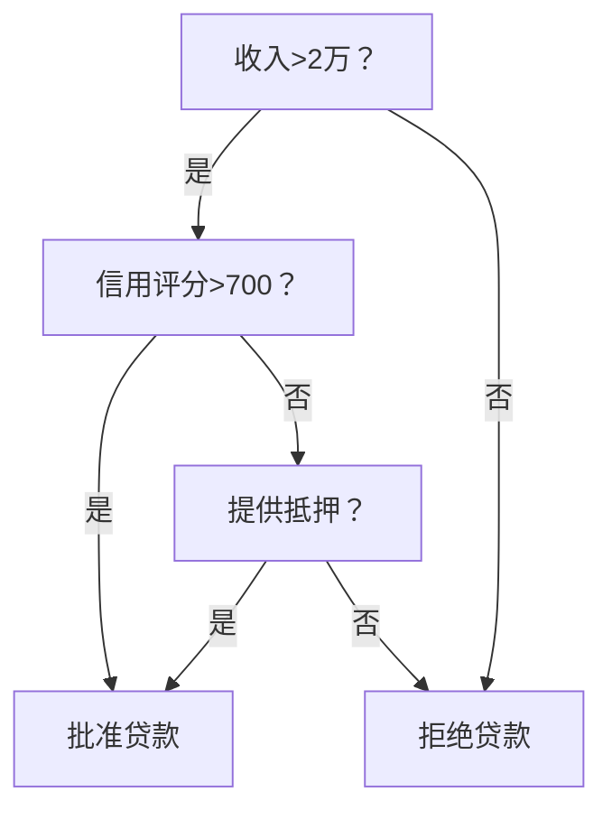
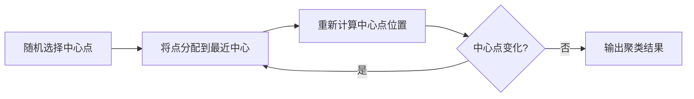
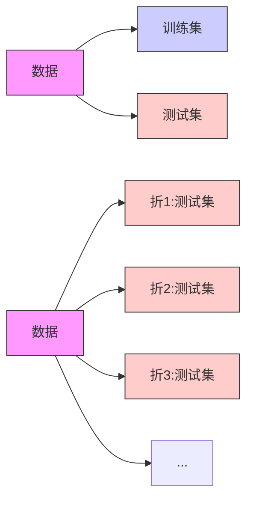

# 机器学习核心：零基础入门指南

## 什么是机器学习？
想象一下，你在教孩子区分猫和狗：不是直接告诉他规则，而是给他看各种猫狗图片，让他自己总结特征。  
**这就是机器学习！让计算机通过大量数据自己发现规律。**

## 监督学习：有老师的指导学习
### 1. 线性回归：预测连续值
- ​​核心思想​​：找到一条最佳拟合线，预测连续值结果
- 实例应用​​：根据房子面积预测房价
```python
# 简单线性回归示例
import numpy as np
from sklearn.linear_model import LinearRegression

# 房子面积数据（平方米）
house_sizes = np.array([50, 70, 90, 110]).reshape(-1, 1)
# 对应房价（万元）
prices = np.array([300, 400, 500, 600])

# 创建模型并训练
model = LinearRegression()
model.fit(house_sizes, prices)

# 预测120平房子的价格
prediction = model.predict([[120]])
print(f"预测房价: {prediction[0]:.1f}万元")  # 输出: 预测房价: 700.0万元
```

### 2. 逻辑回归：解决二分类问题
​​- 核心思想​​：计算某件事发生的概率（0-1之间）  
- ​​实例应用​​：判断邮件是否为垃圾邮件
```python
# 垃圾邮件识别示例
from sklearn.linear_model import LogisticRegression

# 假设有以下特征：
# feature1: 邮件包含"免费"次数
# feature2: 邮件包含"获奖"次数
X_train = [[3, 1], [5, 2], [1, 0], [0, 1]]  # 训练数据
y_train = [1, 1, 0, 0]  # 1=垃圾邮件，0=正常邮件

# 创建模型并训练
spam_detector = LogisticRegression()
spam_detector.fit(X_train, y_train)

# 预测新邮件
new_email = [[4, 3]]  # 包含4次"免费"，3次"获奖"
prediction = spam_detector.predict(new_email)
print("垃圾邮件" if prediction[0] == 1 else "正常邮件")  # 输出: 垃圾邮件
```

### 3. 支持向量机(SVM)：找最佳决策边界
​​- 核心思想​​：在数据点之间找到最宽的"隔离带"
​​- 实例应用​​：手写数字识别


### 4. 决策树：树状决策模型
- ​​工作原理​​：像"20个问题"游戏，通过一系列问题得出结论
​​- 实例应用​​：贷款审批决策


### 5. 集成方法：团结力量大
三种常用方法：
| 方法         | 工作原理                     | 优点                  |
|--------------|----------------------------|-----------------------|
| 随机森林     | 多棵树共同投票               | 抗过拟合能力强        |
| 梯度提升树   | 后一棵树修正前一棵树的错误    | 预测精度高            |
| AdaBoost     | 重点训练难分类样本           | 处理不平衡数据        |

## 无监督学习：无人指导的自我发现
### 1. 聚类分析：物以类聚
**K-means聚类**
- ​​工作原理​​：自动将数据分成K个簇
- ​​实例应用​​：市场细分分析
```python
# 客户分群示例
from sklearn.cluster import KMeans
import numpy as np

# 假设有两种客户特征：购买频率和平均客单价
customer_data = np.array([
    [1, 100],   # 客户1
    [5, 500],   # 客户2
    [1, 150],   # 客户3
    [6, 550]    # 客户4
])

# 创建K=2的聚类模型
kmeans = KMeans(n_clusters=2)
kmeans.fit(customer_data)

# 查看分群结果
print("客户分群结果:", kmeans.labels_)
# 可能输出: [0, 1, 0, 1] 表示分成两组
```
**K-means可视化过程：**

**DBSCAN聚类**
- ​​特点​​：自动发现任意形状的聚类簇
​​- 适用场景​​：地理数据聚类

### 2. 降维技术：化繁为简
**主成分分析(PCA)**
- ​​工作原理​​：将高维数据压缩到关键维度
- ​​实例应用​​：人脸识别特征提取
```python
# PCA降维示例
from sklearn.decomposition import PCA
import numpy as np

# 创建一些三维数据
data = np.array([
    [1, 2, 3],
    [4, 5, 6],
    [7, 8, 9],
    [10, 11, 12]
])

# 创建PCA模型，降到二维
pca = PCA(n_components=2)
reduced_data = pca.fit_transform(data)

print("降维后数据:")
print(reduced_data)
```
**t-SNE技术**
-​​ 特点​​：保持相似点彼此接近
​​- 适用场景​​：高维数据可视化（如MNIST手写数字）

## 模型评估与优化
### 1. 评估指标：考卷评分
**回归问题指标**
| 指标   | 公式                               | 特点                     |
|--------|-----------------------------------|--------------------------|
| MAE    | \( \frac{1}{n}\sum_{i=1}^{n} \|y_i - \hat{y_i}\| \) | 预测值与真实值的平均绝对误差 |
| MSE    | \( \frac{1}{n}\sum_{i=1}^{n}(y_i - \hat{y_i})^2 \) | 对大误差惩罚更大           |
| R²     | \( 1 - \frac{\sum_{i=1}^{n}(y_i - \hat{y_i})^2}{\sum_{i=1}^{n}(y_i - \bar{y})^2} \) | 表示模型解释力           |

**分类问题指标**
| 指标     | 计算公式                                | 适用场景             |
|----------|----------------------------------------|----------------------|
| 准确率   | \( \frac{TP + TN}{TP + FP + FN + TN} \) | 均衡数据             |
| 精确率   | \( \frac{TP}{TP + FP} \)               | 注重预测质量         |
| 召回率   | \( \frac{TP}{TP + FN} \)               | 注重查全率           |
| F1分数   | \( 2 \times \frac{Precision \times Recall}{Precision + Recall} \) | 综合指标             |

### 2. 交叉验证：防止过拟合
**​​传统验证 vs K折交叉验证**

```python
# 交叉验证示例
from sklearn.model_selection import cross_val_score
from sklearn.ensemble import RandomForestClassifier

# 创建模型
model = RandomForestClassifier()

# 使用5折交叉验证
scores = cross_val_score(model, X, y, cv=5)

print(f"交叉验证得分: {scores}")
print(f"平均准确率: {scores.mean():.2f}")
```
### 3. 超参数调优：模型微调
​​**两种主要方法​​：**
1. **网格搜索**​​：尝试所有可能的参数组合
```python
from sklearn.model_selection import GridSearchCV

param_grid = {
    'n_estimators': [50, 100, 200],
    'max_depth': [3, 5, 7]
}

grid_search = GridSearchCV(RandomForestClassifier(), param_grid, cv=5)
grid_search.fit(X_train, y_train)

print("最佳参数组合:", grid_search.best_params_)
```
2. ​**随机搜索**​​：随机采样参数组合，更高效
```python
from sklearn.model_selection import RandomizedSearchCV

param_dist = {
    'n_estimators': range(50, 500, 50),
    'max_depth': range(3, 15)
}

random_search = RandomizedSearchCV(RandomForestClassifier(), 
                                 param_dist, 
                                 n_iter=20, 
                                 cv=5)
random_search.fit(X_train, y_train)
```
# 机器学习工作流程总结
```mermaid
%% 链表/树/图 - 使用Mermaid绘制
graph TD
    A[理解问题] --> B[数据收集]
    B --> C[数据预处理]
    C --> D[模型选择]
    D --> E[模型训练]
    E --> F[模型评估]
    F --> G{效果满意?}
    G -->|否| D
    G -->|是| H[超参数调优]
    H --> I[最终模型评估]
    I --> J[模型部署]

记住：机器学习不是魔法！好的模型 = 70%数据质量 + 20%特征工程 + 10%模型选择与调优  
开始你的机器学习之旅吧！实践是最好的学习方法，尝试解决Kaggle上的入门竞赛来积累经验。
