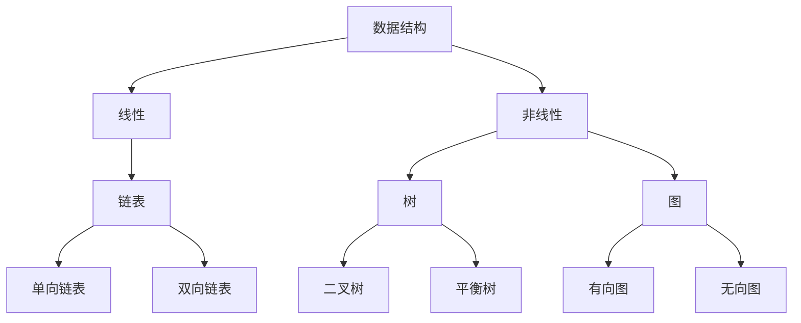
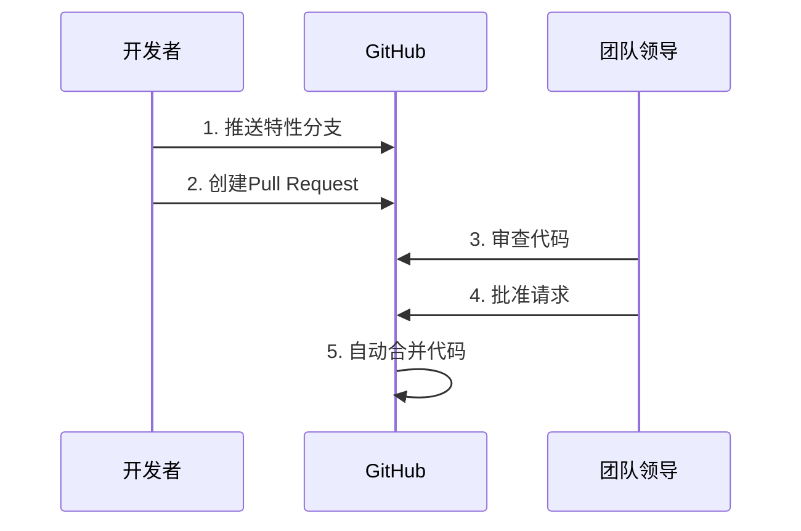

# Python入门基础：零基础小白学习指南

## Python语法基础

### 1.变量与数据类型
变量就像生活中的“标签”，给数据起名字方便使用：
```python
# 创建变量
name = "小明"        # 字符串 (文字)
age = 20             # 整数 (数字)
height = 1.75        # 浮点数 (带小数点的数字)
is_student = True    # 布尔值 (真/假)

print(name)          # 输出: 小明
print(age + 5)       # 输出: 25
```

### 2.控制结构：条件判断
如果...那么...否则...的逻辑：
```python
# 条件判断示例
temperature = 28

if temperature > 30:
    print("太热了！开空调")
elif temperature > 20:
    print("天气真舒服")
else:
    print("有点冷，多穿点")
```

### 3.控制结构：循环
重复执行某些操作：
```python
# for循环示例 - 遍历序列
fruits = ["苹果", "香蕉", "橙子"]

for fruit in fruits:
    print(f"我爱吃{fruit}")

# while循环示例 - 达到条件前重复
count = 0
while count < 5:
    print(f"这是第{count+1}次说你好")
    count += 1
```

### 4. 函数定义与调用
把常用操作打包成"工具"：
```python
# 定义函数：计算圆的面积
def circle_area(radius):
    area = 3.14 * radius * radius
    return area

# 使用函数
print(circle_area(5))  # 计算半径为5的圆面积
```
### 5. 类与面向对象编程
创建自定义的数据类型：
```python
# 定义"汽车"类
class Car:
    # 初始化方法(给新车设置属性)
    def __init__(self, brand, color):
        self.brand = brand
        self.color = color
    
    # 类的方法(行为)
    def drive(self):
        print(f"{self.color}色的{self.brand}正在行驶")

# 使用类创建对象
my_car = Car("特斯拉", "黑")
my_car.drive()  # 输出: 黑色的特斯拉正在行驶
```

### 6. 异常处理
防止程序出错时崩溃：
```python
# 尝试打开一个不存在的文件
try:
    file = open("不存在的文件.txt", "r")
except FileNotFoundError:
    print("找不到文件！请检查文件名")
```

## 数据结构基础

### 1.列表/元组/字典/集合
| 类型   | 特点                 | 示例                                 |
|--------|----------------------|--------------------------------------|
| 列表   | 可修改的有序集合     | `fruits = ["苹果", "香蕉", "橙子"]`  |
| 元组   | 不可修改的有序集合   | `point = (3, 5)`                     |
| 字典   | 键值对集合           | `student = {"姓名": "小明", "年龄": 20}` |
| 集合   | 无重复元素的无序集   | `unique_numbers = {1, 2, 3, 2} → {1, 2, 3}` |
```python
# 综合示例
# 购物清单（列表）
shopping_list = ["牛奶", "鸡蛋", "面包"]

# 商品价格（字典）
prices = {
    "牛奶": 15.5,
    "鸡蛋": 12.8,
    "面包": 8.0
}

# 计算总价
total = 0
for item in shopping_list:
    if item in prices:
        total += prices[item]

print(f"购物总价: {total}元")  # 输出: 购物总价: 36.3元
```
### 2.栈与队列
两种数据操作方式：
- ​​栈（Stack）​​：后进先出（LIFO），像叠盘子
```python
# 使用列表实现栈
stack = []
stack.append("第1盘")  # 放入
stack.append("第2盘")
top = stack.pop()      # 取出: "第2盘"
```
- ​​队列（Queue）​​：先进先出（FIFO），像排队
```python
# 使用队列
from collections import deque
queue = deque()
queue.append("第1人")  # 排队
queue.append("第2人")
first = queue.popleft()  # 服务: "第1人"
```

### 3. 链表/树/图
常用数据结构可视化比较：

实际应用：
- ​​链表​​：浏览器历史记录
- 树​​：文件系统组织
- 图​​：社交网络关系

### 4. 时间/空间复杂度分析
评估算法效率的方法：
- 时间复杂度​​：算法运行时间随输入规模增长的变化
- 空间复杂度​​：算法运行所需内存空间的变化

常见时间复杂度：
- O(1) - 固定时间（最好）
- O(log n) - 对数时间（很好）
- O(n) - 线性时间（好）
- O(n²) - 平方时间（较差）

示例：查找列表中是否存在某元素
```python
# 简单查找 - O(n)
def simple_search(items, target):
    for item in items:
        if item == target:
            return True
    return False

# 二分查找（有序列表）- O(log n)
def binary_search(items, target):
    low, high = 0, len(items)-1
    while low <= high:
        mid = (low + high) // 2
        if items[mid] == target:
            return True
        elif items[mid] < target:
            low = mid + 1
        else:
            high = mid - 1
    return False
```

# 算法基础
## 1. 搜索算法
在数据集中查找特定元素：
| 方法       | 场景         | 优点         | 缺点               |
|------------|--------------|--------------|--------------------|
| 线性搜索   | 无序列表     | 简单直接     | 效率低(O(n))      |
| 二分搜索   | 有序列表     | 高效(O(log n)) | 要求列表有序       |

示例：二分查找实现
```python
def binary_search(items, target):
    # 起点和终点索引
    low, high = 0, len(items)-1
    
    while low <= high:
        # 计算中间位置
        mid = (low + high) // 2
        mid_value = items[mid]
        
        # 找到目标
        if mid_value == target:
            return mid
        
        # 目标在右侧
        elif mid_value < target:
            low = mid + 1
        
        # 目标在左侧
        else:
            high = mid - 1
    
    # 未找到
    return -1
```
## 2. 排序算法
重新排列元素顺序：
| 方法       | 平均复杂度       | 特点              |
|------------|------------------|-------------------|
| 冒泡排序   | \( O(n^2) \)     | 简单但慢          |
| 快速排序   | \( O(n \log n) \) | 高效，常用        |
| 归并排序   | \( O(n \log n) \) | 稳定，大数据处理  |

快速排序示例：
```python
def quicksort(arr):
    if len(arr) <= 1:
        return arr
    
    pivot = arr[len(arr) // 2]  # 选择中间值作为基准
    left = [x for x in arr if x < pivot]
    middle = [x for x in arr if x == pivot]
    right = [x for x in arr if x > pivot]
    
    return quicksort(left) + middle + quicksort(right)
```
## 3. 动态规划
把大问题分解成小问题，并存储小问题结果：
- 适合求解：斐波那契数列、最短路径等
- 核心思想：避免重复计算，使用缓存
斐波那契数列动态规划实现：
```python
def fib(n):
    # 存储计算结果
    cache = [0, 1]  
    
    # 从2开始计算并存储结果
    for i in range(2, n+1):
        cache.append(cache[i-1] + cache[i-2])
    
    return cache[n]

print(fib(10))  # 输出: 55
```
## 4. 贪心算法
每一步都选择当前最优解：
- 特点：简单高效，但不一定能得到全局最优
- 应用场景：零钱兑换、哈夫曼编码等
零钱兑换示例：
```python
def coin_change(coins, amount):
    # 排序硬币（从大到小）
    coins.sort(reverse=True)
    result = []
    
    # 尝试使用每个硬币
    for coin in coins:
        while amount >= coin:
            amount -= coin
            result.append(coin)
    
    return result

# 用最少硬币组成86分
coins = [1, 5, 10, 25]
print(coin_change(coins, 86))  # [25, 25, 25, 10, 1]
```

# Git/GitHub 版本控制
## 1. 版本控制基础
什么是版本控制？记录文件变化的历史记录系统
核心概念：
- 仓库（Repository）​​：项目的文件夹及其历史记录
- 提交（Commit）​​：一次版本保存（含描述信息）
- 分支（Branch）​​：隔离的实验空间


## 2. 分支管理
在不同分支上进行开发：
```bash
# 1. 创建新分支
git branch new-feature

# 2. 切换到该分支
git checkout new-feature

# 3. 在新分支上进行开发修改...
git add .
git commit -m "添加新功能"

# 4. 完成后合并到主分支
git checkout main
git merge new-feature

# 5. 推送到远程仓库
git push origin main
```
## 3. 合并请求工作流（Pull Request）
团队协作的标准流程：

## 4. 代码协作最佳实践
1.​​每日提交​​：小步前进，多次提交  
2.​​清晰的提交信息​​：
```bash
# 差的信息: "修复问题"
# 好的信息: "修复登录页面验证码不显示的问题"
```
​​3.分支命名规范​​：
- feature/user-authentication（新功能）
- fix/button-alignment（修复问题）  

4.使用.gitignore文件排除不需要跟踪的文件    
5.定期git pull拉取他人更改，减少冲突
