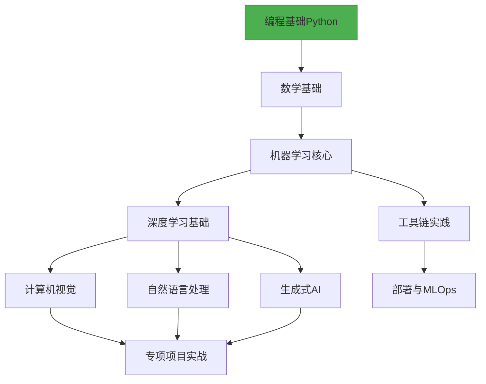

# 🚀 AI-Learning - 从零开始的 AI 方向学习生活

> **结构化 | 持续更新 | 自驱学习**  
> 为所有对 AI 知识感兴趣的学习者提供的 AI/ML/DL 系统学习指南，包含精选资源、代码示例和实践路径

[](Python)
[](CONTRIBUTING.md)
[](https://github.com/Natsume1710/AI-Learning)

## 🌟 项目亮点

- **清晰学习路径**：可视化路线图指引学习方向
- **精选资源**：只推荐高质量课程/教材/论文
- **实战导向**：每个模块附带代码示例和项目
- **持续更新**：紧跟 AI 领域最新进展
- **社区共建**：欢迎贡献您的知识和经验



## 📚 学习路线图

### 阶段 0：前置知识
- **编程基础**  
  Python语法 · 数据结构 · 算法基础 · Git/GitHub
- **数学基础**  
  线性代数 · 概率统计 · 微积分 · 优化方法

### 阶段 1：机器学习核心
- **监督学习**  
  线性/逻辑回归 · SVM · 决策树 · 集成方法
- **无监督学习**  
  聚类(K-means, DBSCAN) · 降维(PCA, t-SNE)
- **模型评估与优化**  
  交叉验证 · 超参数调优 · 评估指标

### 阶段 2：深度学习

| 方向         | 核心技术                        | 学习资源                             |
|--------------|---------------------------------|--------------------------------------|
| 基础理论     | 神经网络·反向传播·正则化        | [深度学习](https://www.deeplearningbook.org/) |
| 计算机视觉   | CNN·目标检测·图像分割           | [CS231n](http://cs231n.stanford.edu/)         |
| NLP          | RNN/Transformer·词嵌入          | [BERT论文](https://arxiv.org/abs/1810.04805)  |
| 生成模型     | GAN·Diffusion·LLMs              | [Hugging Face](https://huggingface.co/)       |

### 阶段 3：工具与实践
- **框架掌握**  
  PyTorch · TensorFlow · JAX
- **数据处理**  
  Pandas · NumPy · OpenCV · NLTK
- **模型部署**  
  ONNX · TensorRT · Flask/Django
- **MLOps基础**  
  MLflow · Weights & Biases · Docker


## 🚪 快速入口
根据你的背景选择起点：
- **我是编程新手** → Python 快速入门
- **我有Python基础** → 机器学习核心概念
- **我想直接实战** → 初级项目集
- **我要深入研究** → 论文精读指南

## 🛠️ 实战项目示例
### CNN图像分类示例 - PyTorch

```python
# CNN图像分类示例 - PyTorch
import torch
import torchvision
import torch.nn as nn
import torch.optim as optim
from torchvision import transforms, datasets
```

### 1. 加载数据集
```python
transform = transforms.Compose([
    transforms.ToTensor(),
    transforms.Normalize((0.5, 0.5, 0.5), (0.5, 0.5, 0.5))
])
train_set = datasets.CIFAR10(root='./data', train=True, download=True, transform=transform)
train_loader = torch.utils.data.DataLoader(train_set, batch_size=64, shuffle=True)
```

### 2. 构建CNN模型
```python
class CNNClassifier(nn.Module):
    def __init__(self):
        super(CNNClassifier, self).__init__()
        self.conv1 = nn.Conv2d(3, 32, kernel_size=3, padding=1)
        self.relu1 = nn.ReLU()
        self.pool1 = nn.MaxPool2d(2)
        self.conv2 = nn.Conv2d(32, 64, kernel_size=3, padding=1)
        self.relu2 = nn.ReLU()
        self.pool2 = nn.MaxPool2d(2)
        self.flatten = nn.Flatten()
        self.fc1 = nn.Linear(64 * 8 * 8, 512)
        self.relu3 = nn.ReLU()
        self.fc2 = nn.Linear(512, 10)

    def forward(self, x):
        x = self.pool1(self.relu1(self.conv1(x)))
        x = self.pool2(self.relu2(self.conv2(x)))
        x = self.flatten(x)
        x = self.relu3(self.fc1(x))
        x = self.fc2(x)
        return x

model = CNNClassifier()
```

### 3. 训练模型
```python
criterion = nn.CrossEntropyLoss()
optimizer = optim.Adam(model.parameters(), lr=0.001)

for epoch in range(10):
    running_loss = 0.0
    for i, (images, labels) in enumerate(train_loader, 0):
        optimizer.zero_grad()
        outputs = model(images)
        loss = criterion(outputs, labels)
        loss.backward()
        optimizer.step()
        
        running_loss += loss.item()
        
    print(f'Epoch {epoch+1}, Loss: {running_loss/len(train_loader):.4f}')

print('训练完成!')
```

### 🔍 更多完整项目：

- [图像分类实战](https://example.com/projects/image-classification)  
- [文本情感分析](https://example.com/projects/sentiment-analysis)  
- [聊天机器人构建](https://example.com/projects/chatbot-system)
